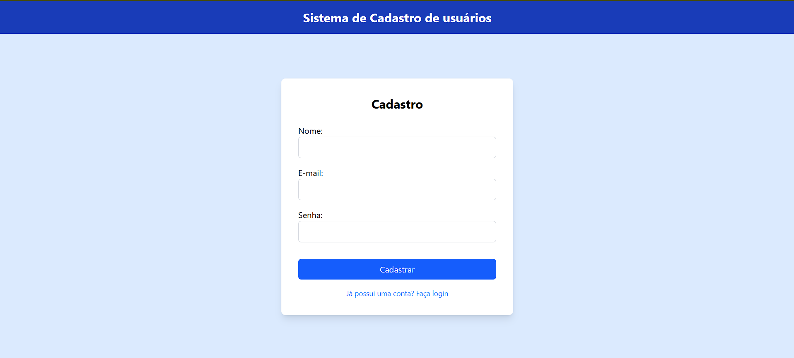
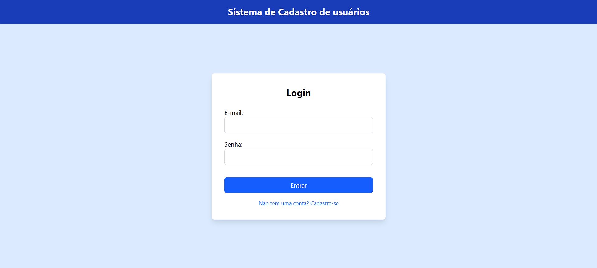

---

# 👤 Sistema de Cadastro de Usuários

Um front-end para sistema de cadastro de usuários com autenticação JWT, construído com **React**, **Tailwind CSS** e **Axios**.


---

## 🖼️ Screenshots da Interface

### Tela de Cadastro

<div>
  
  <p><em>Interface de cadastro com campos para nome, e-mail e senha</em></p>
</div>

### Tela de Login

<div>
  
  <p><em>Interface de login simplificada e intuitiva</em></p>
</div>

---

## 📋 Sobre o Projeto

Este projeto é um front-end completo para um sistema de cadastro de usuários, desenvolvido com foco na experiência do usuário e segurança. Utiliza autenticação JWT para garantir a proteção das informações dos usuários e oferece uma interface moderna, intuitiva e minimalista.

### ✨ Características Principais

* 🔐 **Autenticação JWT** - Sistema seguro de login e controle de acesso
* 📱 **Design Responsivo** - Interface adaptável para diferentes dispositivos
* ⚡ **Performance Otimizada** - Construído com Vite para carregamento rápido
* 🎨 **Interface Moderna** - Estilização com Tailwind CSS
* 🔄 **Roteamento Dinâmico** - Navegação fluida com React Router
* 📡 **Comunicação API** - Integração eficiente com backend via Axios

---

## 🚀 Tecnologias Utilizadas

* **React 19.1.0** - Biblioteca JavaScript para interfaces de usuário
* **React Router DOM 7.7.0** - Roteamento para aplicações React
* **Tailwind CSS 4.1.11** - Framework CSS utilitário
* **Axios 1.11.0** - Cliente HTTP
* **Vite 7.0.4** - Build tool e bundler
* **ESLint 9.30.1** - Linter
* **TypeScript** - Tipagem estática

---

## 📁 Estrutura do Projeto

```
front-cadastrar-usuarios/
├── public/
│   └── vite.svg
├── src/
│   ├── assets/
│   │   └── react.svg
│   ├── components/
│   │   └── header.jsx
│   ├── pages/
│   │   ├── Cadastro/
│   │   │   └── index.jsx
│   │   ├── Dashboard/
│   │   │   └── index.jsx
│   │   └── Login/
│   │       └── index.jsx
│   ├── services/
│   │   └── api.js
│   ├── App.jsx
│   ├── index.css
│   └── main.jsx
├── eslint.config.js
├── package.json
├── README.md
└── vite.config.js
```

---

## 🛠️ Instalação e Configuração

### Pré-requisitos

* Node.js (versão 16 ou superior)
* npm ou yarn

### Passos

```bash
git clone https://github.com/jacoryan-dev/front-cadastrar-usuarios.git
cd front-cadastrar-usuarios
npm install
npm run dev
```

Acesse: [http://localhost:5173](http://localhost:5173)

---

## 📱 Funcionalidades

* Login e logout de usuários
* Cadastro de novos usuários
* Dashboard com dados básicos
* Proteção de rotas privadas
* Interface responsiva com feedback visual

---

## 🧪 Scripts Disponíveis

```bash
npm run dev       # Desenvolvimento
npm run build     # Build de produção
npm run lint      # Verificação de código
npm run preview   # Preview da build
```

---

## 🌐 API Integration

Principais endpoints:

* `POST /auth/login` - Autenticação
* `POST /auth/register` - Cadastro
* `GET /users/profile` - Perfil
* `PUT /users/profile` - Atualização

---

## 📦 Build e Deploy

```bash
npm run build
```

Deploy sugerido: Vercel, Netlify, GitHub Pages ou AWS S3.

---

## 📄 Licença

Este projeto está sob a licença MIT. Veja o arquivo [LICENSE](LICENSE) para mais detalhes.

---

## 👨‍💻 Autor

**Jacoryan Dev**
GitHub: [@jacoryan-dev](https://github.com/jacoryan-dev)

---

⭐ Se gostou do projeto, considere dar uma estrela no repositório!

---

Quer que eu também **adicione badges extras** (versão do Node, status do build, licença) e **uma tabela bonita de tecnologias**?
Posso deixar com **estilo profissional de projeto open source** (tipo repositórios famosos). Quer?
